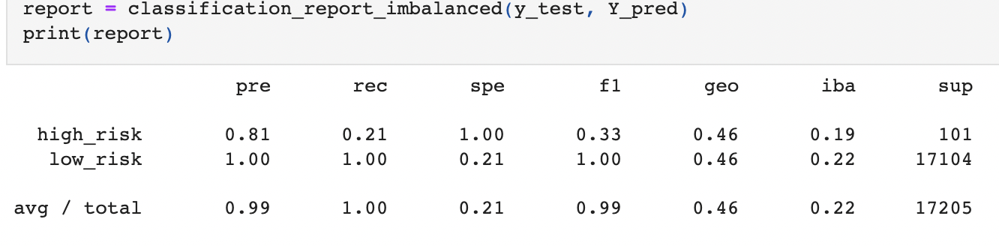
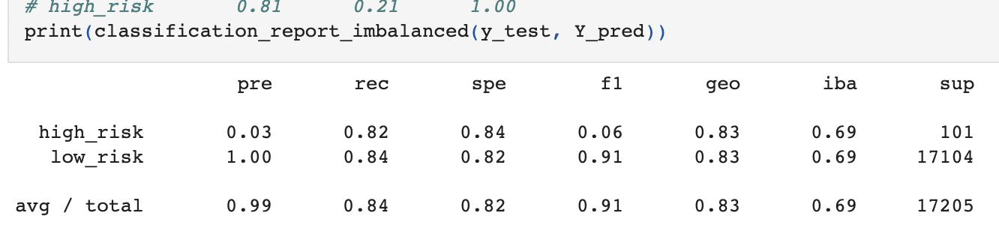
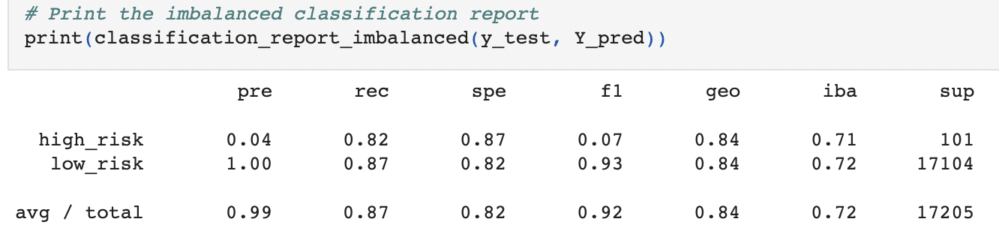
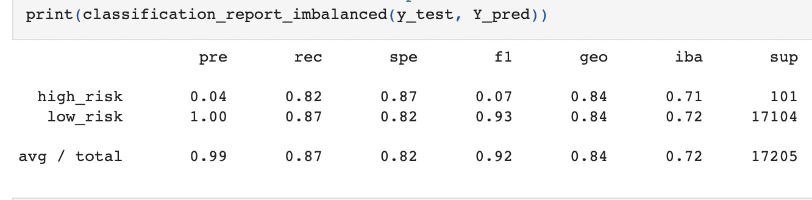
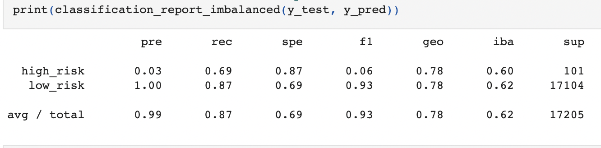
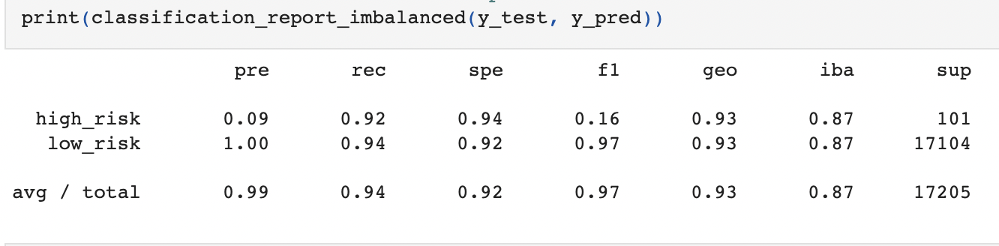

# Credit_Risk_Analysis

## Overview
The purpose of this analysis is to identify credit card risk for high versus low risk loans. As this issue is inherently imbalanced (more low risk loans than high risk), this analysis utilizes imbalanced machine learning to identify the probabilities.

## Results

Results of splitting and training data

Results of RandomOverSampler

Results of SMOTE Oversampling

Results of ClusterCentroids Undersampling

Results of SMOTEENN Sampling

Results of Balanced Random Forest Classifer

Results of Easy Ensemble AdaBoost Classifier

## Summary
