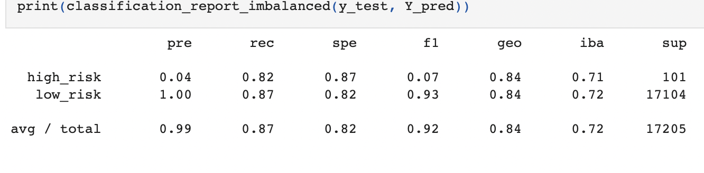

# Credit_Risk_Analysis

## Overview
The purpose of this analysis is to identify credit card risk for high versus low risk loans. As this issue is inherently imbalanced (more low risk loans than high risk), this analysis utilizes imbalanced machine learning to identify the probabilities.

## Results

Results of splitting and training data

Results of RandomOverSampler

Results of SMOTE Oversampling

Results of ClusterCentroids Undersampling

Results of SMOTEENN Sampling

Results of Balanced Random Forest Classifer

Results of Easy Ensemble AdaBoost Classifier

## Summary
Due to the imbalanced nature of the dataset (high risk vs. low risk) it seems there isn't much difference in the resulting data according to machine learning method. The results that see the biggest difference are the ensemble classifiers, Balanced Random Forest Classifier and Easy Ensemble AdaBoost Classifier. I would reccommend using these models for further analysis as a greater difference is seen and can be used in making a wider scale for decision-making.
